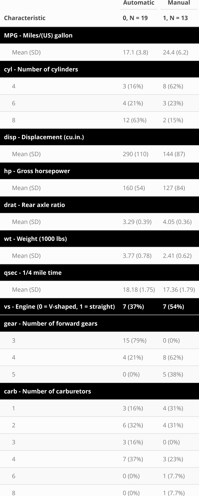

\begin{center}
 \begin{huge} 
\ Regression Model Project \\
\end{huge}
\ By Angie Marchany-Rivera \\
\ 08/03/2021 \\
\end{center} 

```{r setup, include=FALSE}
knitr::opts_chunk$set(echo = TRUE,warning=FALSE, message=FALSE,cache=TRUE)
options(tinytex.verbose = TRUE)
```

```{r include=FALSE, message=FALSE, warning=FALSE}
library(knitr)
hook_output <- knit_hooks$get("output")
knit_hooks$set(output = function(x, options) {
  lines <- options$output.lines
  if (is.null(lines)) {
    return(hook_output(x, options))  # pass to default hook
  }
  x <- unlist(strsplit(x, "\n"))
  more <- "..."
  if (length(lines)==1) {        # first n lines
    if (length(x) > lines) {
      # truncate the output, but add ....
      x <- c(head(x, lines), more)
    }
  } else {
    x <- c(more, x[lines], more)
  }
  # paste these lines together
  x <- paste(c(x, ""), collapse = "\n")
  hook_output(x, options)
})
``` 

## Executive Summary
In this analysis we are interested in finding which type of transmission (coded as 'am' where 0 = automatic, 1 = manual) is more efficient in terms of miles per gallon (mpg) using the mtcars dataset in R.The exploratory analyzes of the data suggested that manual transmissions yield higher average mpg than automatic transmissions. This relationship was further analyzed using nested multivariable linear regression models. The variables cyl and disp were removed from the linear regression due to high collinearity with other predictors. Based on this regression it was concluded that manual transmissions yield, in average, 2.4 mpg more than automatic transmissions.

## Loading the mtcars data and performing some basic exploratory data analysis

```{r collapse=TRUE}
library(usdm)
str(mtcars)
```
The mtcars dataset contains 32 observation and 11 variables. This data was further summarized based on the transmission type to explore its relationship with the other variables. It is worth noting that manual transmission yielded higher miles per gallons than automatic transmission (see Appendix A - Table 1: mpg mean values). Linear regression models will be created to analyze the relationship between transmission type and mpg. This analysis will assume that the variable mpg is the desired outcome and the rest of the variables are predictors.

It can be expected that some of the predictors have high correlation values (see Appendix A - Plot 1). Variable correlation was further analyzed using variance inflation factors.

```{r collapse=TRUE, output.lines=c(1,3,5:7)}
vifcor(subset(mtcars,select = (-mpg)),th = 0.8)
```
The vifcor function excludes any predictor with a VIF > 10 since the information that these predictors provide about the response is redundant in the presence of the other variables. Using the vif values as a  guide, the variables disp and cyl were removed from the linear regression model. The effect of removing these predictors were analyzed using anova and the Shaphiro-Wilk test. The results from these tests are shown on the next session.

## Multivariable Regression Models
```{r collapse=TRUE, output.lines = c(1,8,9,10,11,13)}
# Creating 3 nested linear models:
fit1 <- lm(mpg~factor(am),mtcars)
fit2 <- lm(mpg~factor(am)+. -am,mtcars)
fit3 <- lm(mpg~factor(am)+. -am -disp -cyl, mtcars)
# Comparing the 3 models unsing anova
anova(fit1,fit3,fit2)
```
The p-values of the anova test shows that the most significant model is fit3, p-value = 5.772e-06. Checking that the residuals of fit3 follow normality:
```{r collapse=TRUE, output.lines = c(2,5)}
shapiro.test(fit3$residuals)
```
The Shapiro-Wilk p-value of 0.3727 fails to reject normality of the residuals. Normality of the residuals can also be verified by the linearity of the residuals Q-Q plot (see Appendix B - Plots). We can also compare the adjusted R-squared values of the 3 models to confirm that fit3 is the best fit (see Appendix B - Summary for the complete output of the function summary(fit3)).

```{r collapse=TRUE}
cbind(summary(fit1)$adj.r.squared,summary(fit2)$adj.r.squared,summary(fit3)$adj.r.squared )
```
## Conclusion
Based on the analysis performed, the coefficients of the linear model fit3 can be used to summarize the relationship between transmission type and mpg. The coefficient for manual transmission estimates that manual transmissions yield, in average, 2.4 mpg more than automatic transmissions.

\newpage
## Appendix A - Exploratory Graphs and Table
### Plot 1: Relationship between the variables:
```{r fig.height=3.5, fig.width=5, fig.align = "center"}
plot(mtcars, pch = 16, col = "blue") 
```

### Table 1: mtcars dataset - Variable descriptions and summary by transmission type
```{r eval=FALSE}
library(dplyr); library(gtsummary); library(kableExtra)
mtcars %>% tbl_summary(by=am, label=list(mpg ~ "MPG - Miles/(US) gallon",
                                         cyl ~ "cyl - Number of cylinders ",
                                         disp ~ "disp - Displacement (cu.in.)",
                                         hp ~ "hp - Gross horsepower",
                                         drat ~ "drat -	Rear axle ratio",
                                         wt ~ "wt - Weight (1000 lbs)",
                                         qsec ~ "qsec - 1/4 mile time",
                                         vs ~ "vs - Engine (0 = V-shaped, 1 = straight)",
                                         gear ~ "gear -	Number of forward gears",
                                         carb ~	"carb - Number of carburetors"), 
        type=all_continuous() ~ "continuous2",statistic = all_continuous() ~"{mean} ({sd})")%>%
        as_kable_extra() %>% row_spec( c(1,3,7,9,11,13,15,17,18,22),hline_after=TRUE,
                                       bold=TRUE, color = "white",background = "black")%>%
        add_header_above(c(" "=1, "Automatic" = 1, "Manual" = 1),bold=TRUE)%>%
        kable_styling(bootstrap_options = "striped", latex_options = "hold_position", 
                      full_width = F, font_size =12) %>% save_kable("./table1.png",zoom =5)
```
{width=100%}  


\newpage
## Appendix B - Linear Model summary and plot
### Summary of fit3:  
```{r echo=FALSE}
summary(fit3)
```

### Plots of the residuals for fit3:  
```{r out.width = "80%", fig.align = "center", echo=FALSE}
par(mfrow = c(2,2))
plot(fit3)
```

